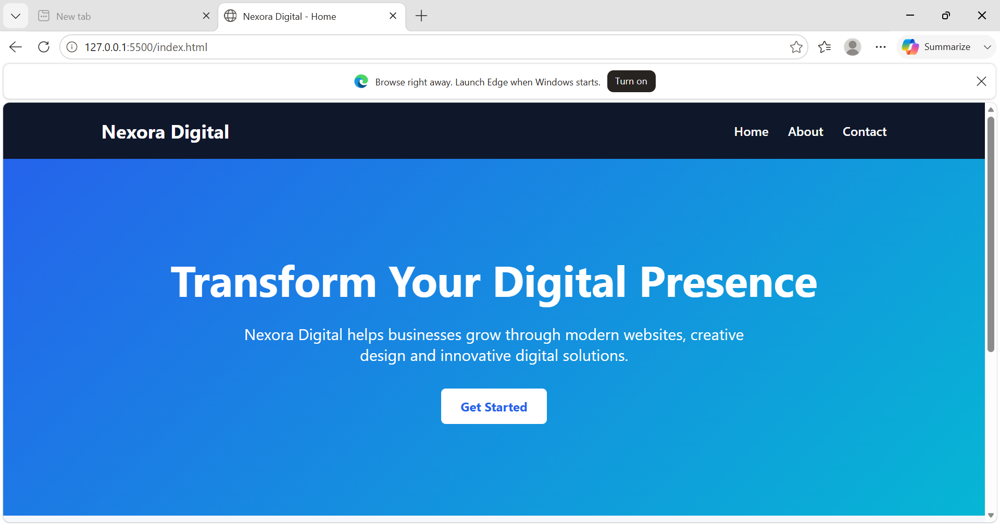
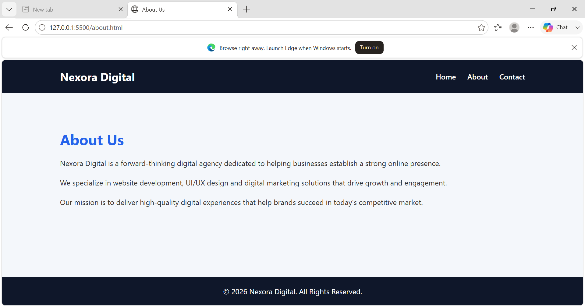
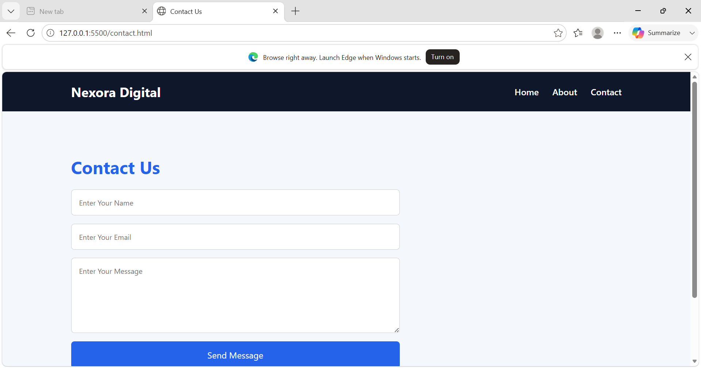

# Nexora Digital

A responsive multi-page business website developed for Full Stack Web Development Internship - Task 2.

## Live Features

✅ Home Page

✅ About Page

✅ Contact Page

✅ Responsive Navigation Bar

✅ Mobile-Friendly Design

✅ JavaScript Form Validation

✅ Modern UI Design

---

## Technologies Used

- HTML5
- CSS3
- JavaScript

---

## Project Structure

```text
Task2-MultiPage-Website
│
├── index.html
├── about.html
├── contact.html
├── style.css
├── script.js
├── README.md
└── screenshots/
```

---

## Screenshots

### Home Page



### About Page



### Contact Page



---

## How to Run

1. Download or clone the repository

```bash
git clone YOUR_REPOSITORY_LINK
```

2. Open the project in VS Code

3. Run index.html using Live Server

---

## Learning Outcomes

- Multi-page website development
- Navigation between pages
- Responsive web design
- Form creation and validation
- Git & GitHub workflow

---

